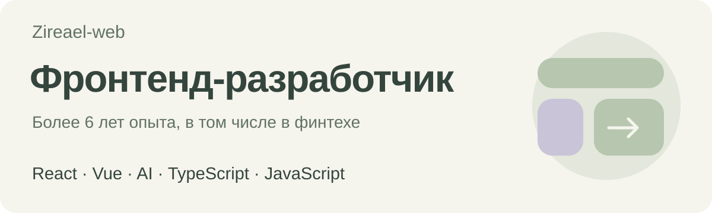
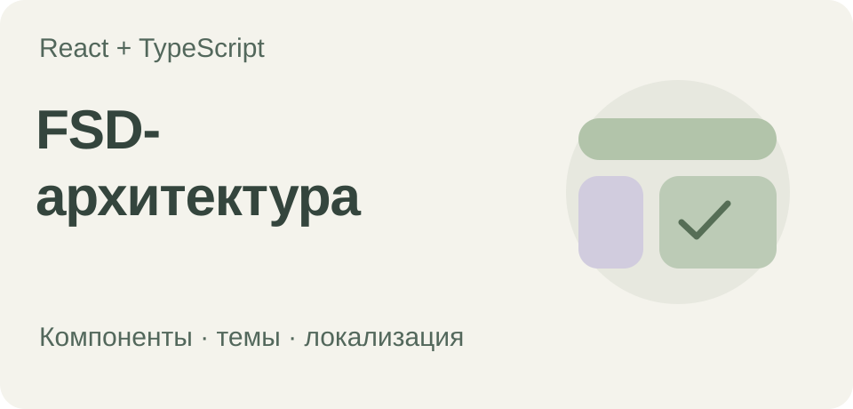

<picture>
  <source media="(prefers-color-scheme: dark)" srcset="assets/hero-dark.svg">
  <source media="(prefers-color-scheme: light)" srcset="assets/hero-light.svg">
  
</picture>

**Фронтенд:** React · Vue · TypeScript, JavaScript · WebSockets, gRPC, REST HTML · CSS / SCSS · Micro frontends  
**Инструменты:** Webpack · Jest · Git · GitHub Actions 
**Браузерные расширения:** Chrome / Chromium · Manifest V3 · Web APIs

### Frontend-проекты

<table>
<tr>
<td width="50%" valign="top">

<strong><a href="https://github.com/Zireael-web/advanced-frontend-project">React-приложение</a></strong>

Тренировал дополнительный стек технологий вокруг экосистемы React, глубоко продумывал с нуля FSD-архитектуру большого продуктового приложения.

</td>
<td width="50%" valign="top">

<strong><a href="https://github.com/Zireael-web/youtube-caption-copy">YouTube Caption Copy</a></strong>

Удобное копирование субтитров видео в буфер обмена.

</td>
</tr>
</table>

### Проекты на других языках

Делаю для собственных задач, заодно осваиваю другие языки и инструменты.

- **[DeskEyeRest](https://github.com/Zireael-web/desk-eye-rest)** — приложение для трекинга экранного времени на macOS. Swift / SwiftUI.
- **[Health Evidence Workbench](https://github.com/Zireael-web/health-evidence-workbench)** — локальный инструмент на Python для работы с медицинскими документами и научными источниками. За основу идеи взял [Claude Science от Anthropic](https://www.anthropic.com/news/claude-science-ai-workbench).
